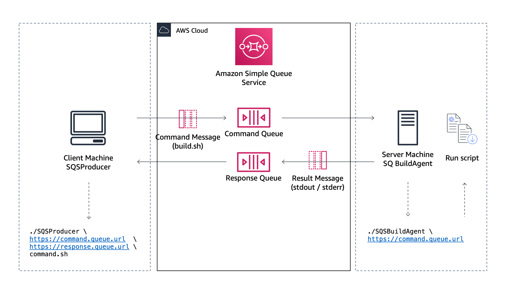

# Amazon SQS-based controller agent

`SQSBuildAgent` is daemon to run commands on a remote machine.

It continuously polls an [Amazon SQS](https://aws.amazon.com/sqs/) queue for messages. When a message is received, it interprets the body of the message as a shell script and runs it.

I am using this agent to send build (compile, sign, test, archive) commands to remote Mac machines running in the cloud. This allows me to implement [continuous delivery and continuous integration pipeline for iOS applications](https://github.com/sebsto/amplify-ios-getting-started/tree/main/code). You can use it for other purposes.

The code is written in the [Swift](https://swift.org/) programming language and has been tested on Linux and macOS Bigsur.

The code uses the [Soto unofficial AWS SDK](https://github.com/soto-project) to make calls the AWS API.  Huge thanks to the [Adam Fowler](https://github.com/sponsors/adam-fowler) and [Fabian Fett](https://fabianfett.de/) for their feedback and suggestions. Thank you Eneko Alonso [for having written](https://www.enekoalonso.com/articles/writing-aws-sqs-producers-and-consumers-in-swift-demo-) a simple SQS Producer and Consumer.

A schema to illustrate the working principle is below.



The tool uses a request / response communication [pattern](https://www.enterpriseintegrationpatterns.com/patterns/messaging/RequestReplyJmsExample.html) based on two SQS queues. One queue is used to send the messages, the second to send the response.  

Client app produces a message. The message contains:
- the `body`, a script file to execute on the server
- the `responseQueue`message attribute, indicating where the response must be posted.

The agent (Consumer) polls the command queue and executes as a script the body part of any message it receives. It captures the script exit code, `stdout`and `stderr`and sends them in the message body, posted on the response queue.

## Create Queues

You can create the two queues using the AWS console or the [AWS CLI](https://docs.aws.amazon.com/cli/latest/userguide/install-cliv2.html):

```bash
REGION=us-east-2
aws --region $REGION sqs create-queue --queue-name command-queue
{
    "QueueUrl": "https://sqs.us-east-2.amazonaws.com/0123456789/command-queue"
}

aws --region $REGION sqs create-queue --queue-name response-queue
{
    "QueueUrl": "https://sqs.us-east-2.amazonaws.com/0123456789/response-queue"
}
```

Take note of the queue URLs, they are needed to invoke the consumer and the producer.

## IAM Permission Required

These are the minimum set of IAM permissions required to run the Producer and Consumer.

```json
{
    "Version": "2012-10-17",
    "Statement": [
        {
            "Sid": "VisualEditor0",
            "Effect": "Allow",
            "Action": [
                "sqs:Receive*",
                "sqs:Send*",
                "sqs:DeleteMessage"
            ],
            "Resource": [
                "arn:aws:sqs:us-east-2:0123456789:command-queue", 
                "arn:aws:sqs:us-east-2:0123456789:response-queue"]
        }
    ]
}
```

## Command line usage 

Once compiled, you can just type.

```bash
./SQSBuildAgent https://command.queue.url
```

To send a test message, you can either use the SQS Console or type this command:

```bash
./SQSProducer \
   https://command.queue.url  \
   https://response.queue.url \
   script_file.sh 
```

## Running it as a daemon

To run `SQSBuildAgent` as a daemon on a macOS machines, as root, copy this file to `/Library/LaunchDaemons`

```bash
sudo cp dist/com.amazon.build.mac.agent.plist /Library/Daemons
```

The file contains instructions to run the agent and the required parameters.  Please update the `ProgramArgumets`to replace with your command queue URL.

```xml
<?xml version="1.0" encoding="UTF-8"?>
<!DOCTYPE plist PUBLIC "-//Apple//DTD PLIST 1.0//EN" "http://www.apple.com/DTDs/PropertyList-1.0.dtd">
<plist version="1.0">
<dict>
    <key>Label</key>
    <string>com.amazon.build.mac.agent</string>
    <key>ProgramArguments</key>
    <array>
        <string>/Users/ec2-user/SQSBuildAgent</string>
        <string>https://sqs.us-east-2.amazonaws.com/0123456789/cicd-command</string>
    </array>
    <key>KeepAlive</key>
    <true/>
    <key>UserName</key>
    <string>ec2-user</string>
    <!-- require for keychain access -->
    <key>SessionCreate</key>
    <true/>    
    <key>RunAtLoad</key>
    <true/>
    <key>StandardErrorPath</key>
    <string>/Users/ec2-user/log/build-agent.log</string>
    <key>StandardOutPath</key>
    <string>/Users/ec2-user/log/build-agent.log</string>
</dict>
</plist>
```

This file is tuned to run on an Amazon EC2 user, adjust it you run on other type of machines.

Notice the following parameters:
- UserName : the daemon will run as this username, all the command received by SQS will also run under this username.
- CreateSession : required when your commands require access to user keychains. When building applications, this is require to access your signing key.

To start the agent as a daemon:
```bash 
# load the daemon with 
sudo launchctl load /Library/LaunchDaemons/com.amazon.build.mac.agent.plist

# stop the daemon with 
sudo launchctl unload /Library/LaunchDaemons/com.amazon.build.mac.agent.plist

# log file are in 
tail -f ~/log/build-agent.log
```

### Automatically install on Amazon EC2

When using this agent on an [Amazon EC2 Mac machines](https://aws.amazon.com/ec2/instance-types/mac/), it is possible to automatically install it at the first boot of the machine, using [EC2 user data](https://docs.aws.amazon.com/AWSEC2/latest/UserGuide/user-data.html) field:

```bash
#!/bin/sh
curl -s https://download.stormacq.com/aws/mac/build/installer.sh | sh
```

## Security Considerations 

Obviously, whoever has the permission to post a SQS message on the command queue has the possibility to execute commands on the machine where the agent (consumer) runs. Please restrict access to the `command`SQS queue accordingly.

## Building it from the sources 

To build this tool, you need to have a Mac or Linux machine with the Swift development environment installed.

### Natively on your OS (Mac or Linux)

You can build the two command line tools using the `swift`command :

```bash 
swift build -c release
```

To run the command :

```bash
# on the producer machine
swift run SQSProducer \
   https://command.queue.url  \
   https://response.queue.url \
   script_file.sh 

# on the consumer machine
swift run SQSBuildAgent https://command.queue.url
```

### Cross compiling for Linux on Mac

To run the consumer or producer on a Linux machine or in a container, you need a linux executable.

To cross compile for Linux from a Mac machine, I am using [the official Swift image](https://hub.docker.com/_/swift) for Amazon Linux 2

```bash
DOCKER_IMAGE_NAME=swift:5.3.3-amazonlinux2
WORKSPACE="$(pwd)/.."
EXECUTABLE=SQSProducer
CONFIGURATION=release

echo "Building $EXECUTABLE"
docker run --rm -v "$WORKSPACE":/workspace -w /workspace $DOCKER_IMAGE_NAME \
       bash -cl "swift build --product $EXECUTABLE -c $CONFIGURATION"
cp $WORKSPACE/.build/x86_64-unknown-linux-gnu/$CONFIGURATION/$EXECUTABLE .
```

## Pricing

Amazon SQS offers a generous [free tier](https://aws.amazon.com/sqs/pricing/) of 1 milliion API request per month.

Using this tool 24/7 falls under the free tier usage of Amazon SQS. (assuming yon run one instance of this tool on one machine, and you do not have other Amazon SQS usage)

## TODO 

I am considering adding the following when I will have time.

1. a full test suite 
2. the possibility to specify an AWS KMS key that the producer would use to sign the message and the Consumer to verify the authenticity of the message.  This would allow to add a security layer, ensuring only authorised producer can send commands to execute.

